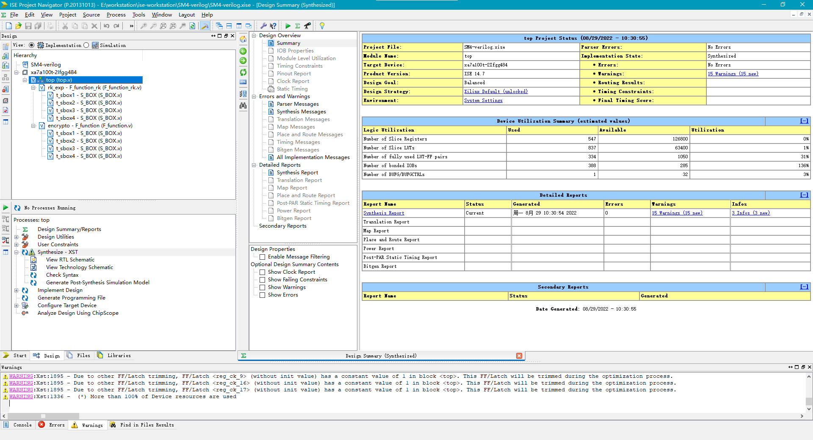
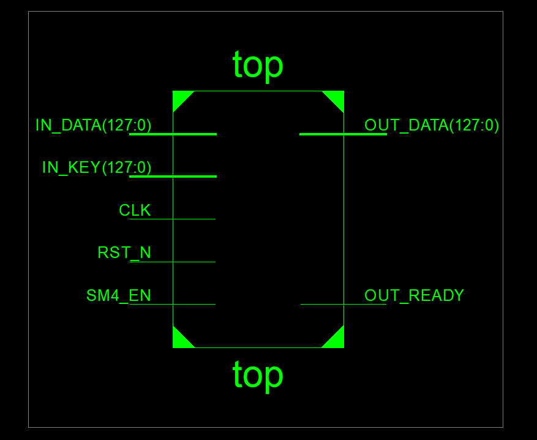
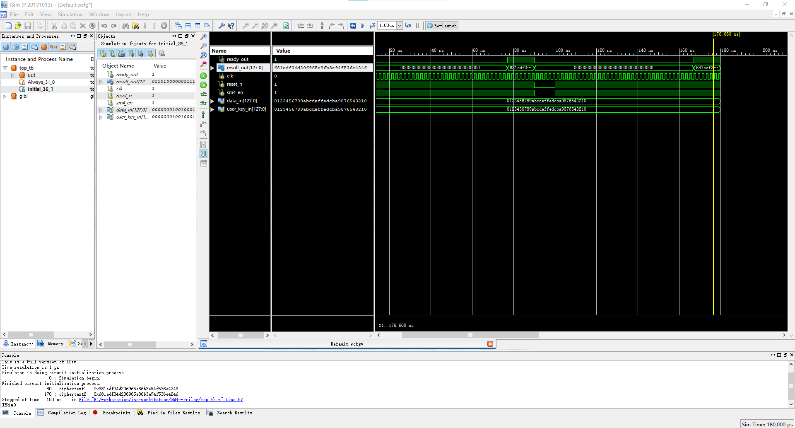

# SM4-verilog

​		This repository is a verilog implement of SM4 encryption part. 

### 1、Result of Simulation (in ModelSim)

### 2、Result of Synthesize 

### 3、RTL Schematic

### 4、Result of Simulation (in ISE)

